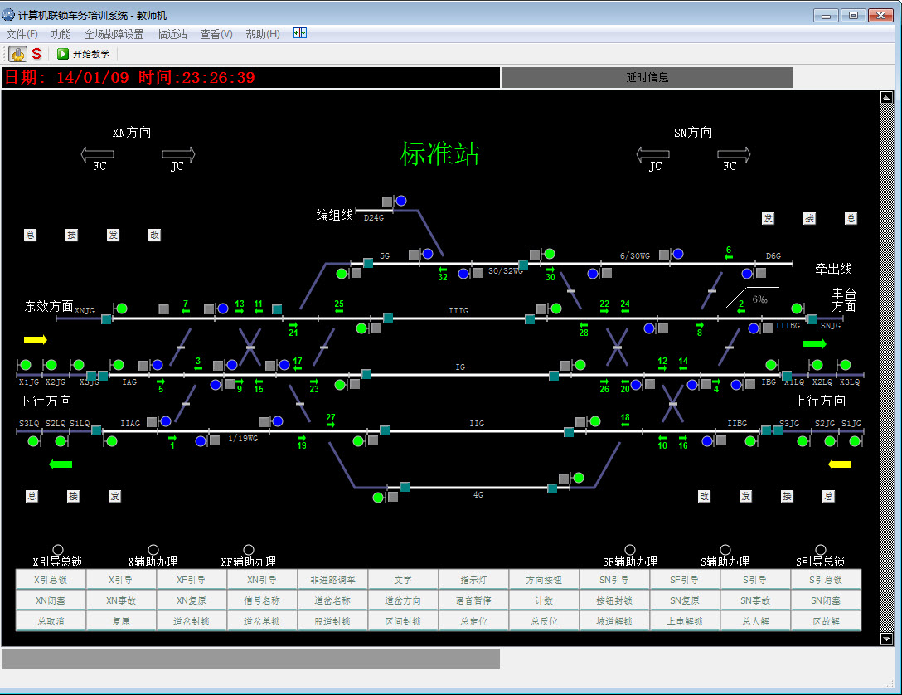
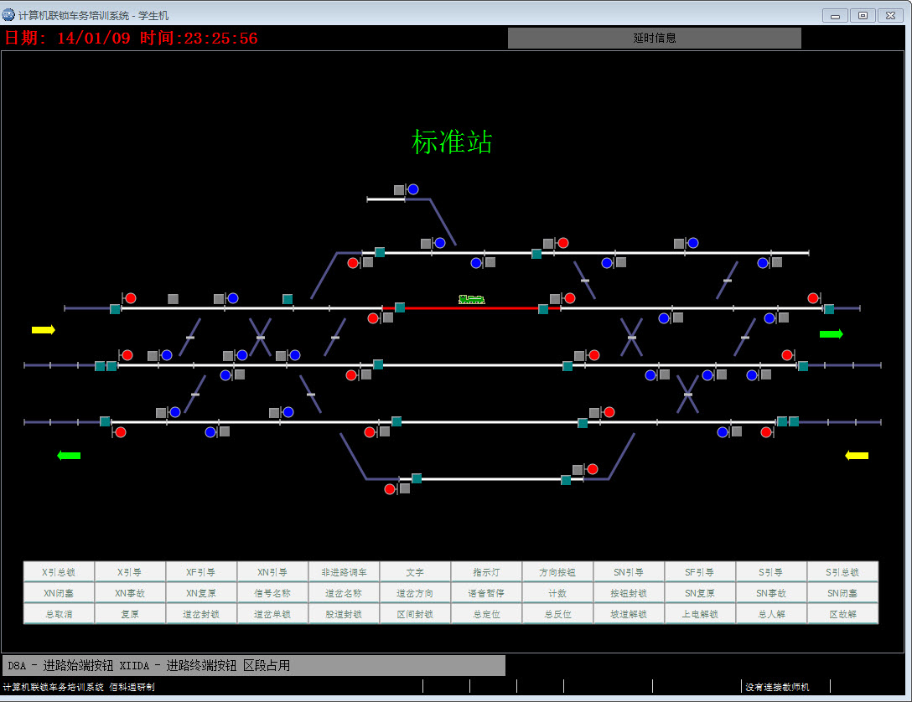
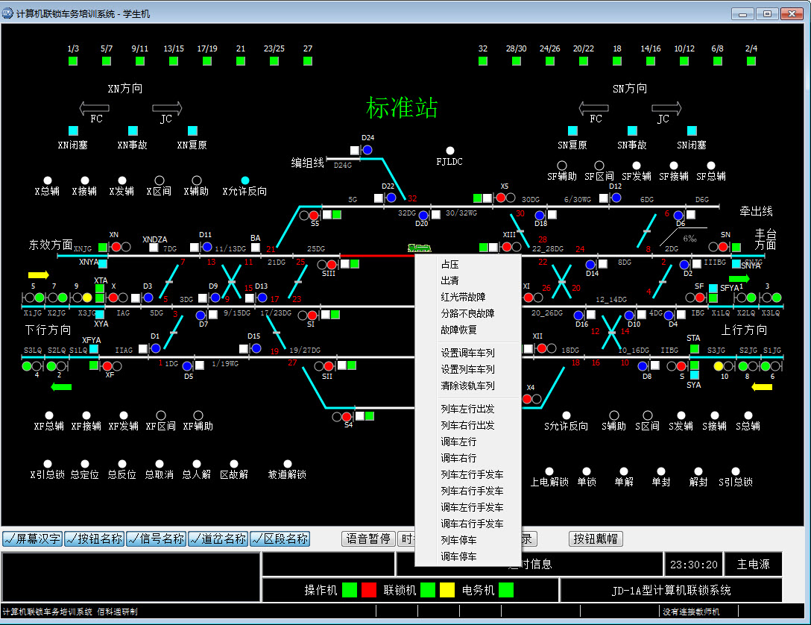
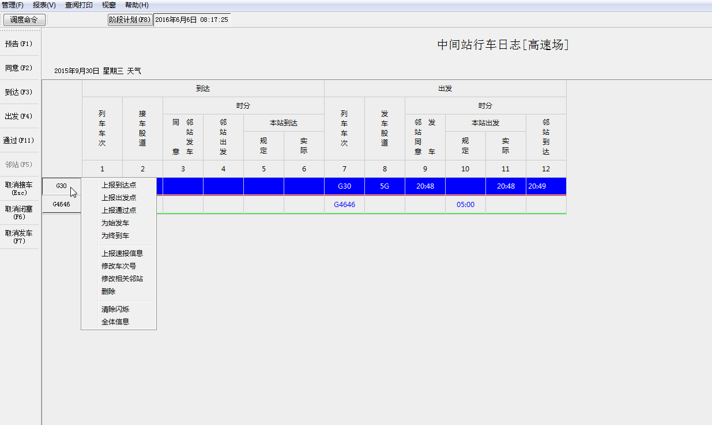

# Railroad
铁路计算机联锁网络教学系统，支持卡斯科、乌西等模式

本系统采用纯软件技术，把计算机联锁上位机操作平台，底层联锁逻辑和模拟现场设备的状态及变化过程集合到一台计算机上构成学员机，在一台计算机上实现了计算机联锁系统的所有功能。同时结合教学及培训的特点，设置了一台教师机来完成学员操作过程的记录、回放并设置设备故障及行车命令以供考核学员的处理作业的能力。由于目前计算机联锁存在多家制式，本系统提供了交大、铁科院、通号设计院三家的操作界面模式的版本，根据需要进行选择安装，更会加强培训的实用效果。

开发环境：QT, C/C++

## 主要功能
1. 包括教师端和学生端，支持1V1,1V5，支持单机
2. 一个教师机可以拖几个客户端，每个客户端可以是不同的站场，不同的模式。例如交大，铁科，卡斯科等。
3. 站场图支持MAP文件自定义
4. 可模拟交大、铁科院、通号设计院不同版本信号系统
5. 教师端可随时模拟各种意外、异常情况，供学生学习如何处理
6. 包含站场日志计划段，可自定义行车计划

## 系统截图
卡斯科模式教师端

卡斯科模式学生端

乌西模式学生端

行车日志子系统

## 与我联系
QQ：81224865
邮箱：[tiger.hu.liu@gmail.com](mailto:tiger.hu.liu@gmail.com)
